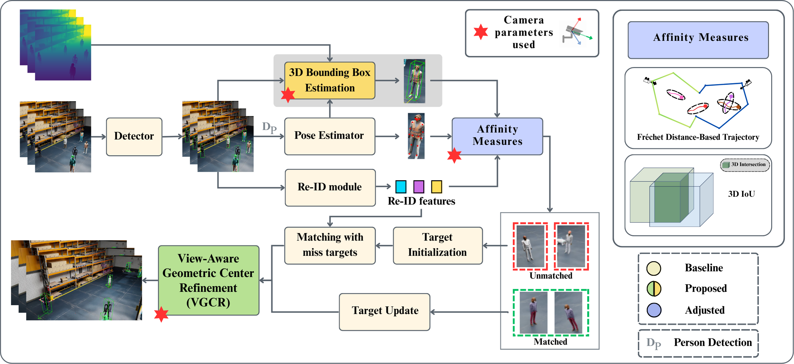

# VGCRTrack: Multi-Camera 3D Tracking with View-Aware Geometric Center Refinement
<p>This is the official repository for the submission to the 9th NVIDIA AI City Challenge 2025 - Track 1: Multi-Camera 3D Perception. </p>

## Overall Pipeline

This is the overall pipeline of our work in the VGCRTrack.

## Dataset 
The official datasets of the Track is available at [AI City Challenge](https://huggingface.co/datasets/nvidia/PhysicalAI-SmartSpaces/blob/main/README.md). 

## Acknowledgement

This project builds upon [PoseTrack](https://github.com/ZhenyuX1E/PoseTrack) by Zelin Ni and Huabin Liu.

If you use this repository, please consider citing PoseTrack as:

```bibtex
@misc{zhenyux1e_posetrack,
  author       = {Zelin Ni and Huabin Liu},
  title        = {PoseTrack: Multi-camera Tracking with Pose and ReID},
  year         = {2024},
  howpublished = {\url{https://github.com/ZhenyuX1E/PoseTrack}},
  note         = {GitHub repository}
}
